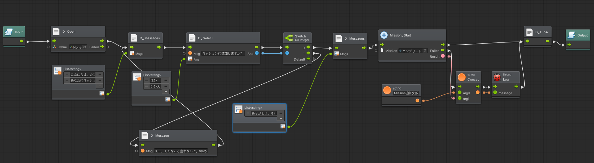

# UniMoonDialogue

* Unityで動作するノベル風シナリオ進行ダイアログのフレームワーク
* C# と BOLT Lua でシナリオを記述できます。  
    

* 開発中のプロジェクトなので、大幅な変更が入る可能性があります

## How to Use 
### C#による記述
* 初期状態ではC#によるシナリオ記述にのみ対応しています。
* サンプルの実行は Assets/UniMoonDialogue/Example/HelloUniMoonDialogue.scene をPlayして、右端の CshrapのCubeをクリックしてください。
* C# によるシナリオ記述方法は、以下、Example　> Csharpによる記述例を参考にしてください。

### BOLTによる記述
* Bolt はデフォルト状態では、利用できません。
* 以下の手順で Boltの実行を有効にしてください。

1. UnityAssetStoreから [Bolt 1.4.13をインポート](https://assetstore.unity.com/packages/tools/visual-scripting/bolt-163802?locale=ja-JP)
1. ProjectSettings > Other Settings > Scripting Define Symbols に 'ENABLE_BOLT' を追加してください。  

1. UniMoonDialogue/Examples/SushiQuest/SushiQuest.sceneがサンプルシーンになっています。 
1. IC2CPPでビルドする際は `AoT Pre-build` を実行してください


### Lua による記述
* Luaスクリプトの読み込みはデフォルト状態では、利用できません。
* Luaスクリプトのパースは[MoonSharp](https://github.com/moonsharp-devs/moonsharp)を利用しています。
* 以下の手順で Luaの実行を有効にしてください。

1. [moonsharp_release_2.0.0.0.zip](https://github.com/moonsharp-devs/moonsharp/releases/tag/v2.0.0.0)　をダウンロード

2. MoonSharp_2.0.0.0.unitypackage をProjectにインポートしてください。/Plugins/MoonSharp/に配置されます。

3. ProjectSettings > Other Settings > Scripting Define Symbols に 'ENABLE_MONOSHARP' を追加してください。

4. Assets/UniMoonDialogue/Example/HelloUniMoonDialogue.scene をPlayして、中央のLua Sample1 のCubeをクリックしてください。
## Example

* Csharpによる記述例 - [PlayScenarioCSharp.cs](Unity/UniMoonDialogue/Assets/UniMoonDialogue/Examples/Scripts/PlayScenarioCSharp.cs)
```cs
private int index = 0;

Scenario scenario = new Scenario(
    dialogs: new Dictionary<int, Dialogue>
    {
        {1,  new Dialogue("こんにちは。私はC#で書かれています。")},
        {2,  new Dialogue("次のメッセージ")},
        {3,  new Dialogue("質問です！",
            choices: new List<Choice>
            {
                new Choice("はい",4),
                new Choice("いいえ",5),
            }
        )},
        {4,  new Dialogue("「はい」を選びましたね",6)},
        {5,  new Dialogue("「いいえ」を選びましたね",6)},
        {6,  new Dialogue("おしまい")}
    }
);

public void StartScenario()
{
    var data = new EventData(gameObject);
    if (ScenarioEngine.Instance.StartScenario(data))
    {
        ScenarioEngine.Instance.OnMessageStart += OnMessageStart;
        ScenarioEngine.Instance.OnMessageEnd += OnMessageEnd;
        ScenarioEngine.Instance.OnUserInput += OnUserInput;
        index = scenario.dialogs.Keys.Min();
        ShowDialogue(data, index);
    }
}
```

* Luaによる記述例 - [Sample1.lua](Unity/UniMoonDialogue/Assets/UniMoonDialogue/Examples/Resources/Sample1.lua)

```lua
return function()
scene.msg( 'Hello。私は、<color=red>赤ちゃんX</color>です。\r\n<size=30>バブバブ。</size>' )
coroutine.yield()

scene.msg( '今日はどこから来たの？' )
coroutine.yield()
 
scene.choice( 'どこから？' , 'Tokyo', 'Hakata', 'Nagoya' )
local selected = coroutine.yield()

if selected == 0 then
    scene.msg( 'へえ。教えてくれないの、、、' )
    coroutine.yield()

elseif selected == 1 then
    scene.msg( 'へぇ。東京なんだ' )
    coroutine.yield()

elseif selected == 2 then
    scene.msg( '博多から来てくれてありがとう' )
    coroutine.yield()
elseif selected == 3 then
    scene.msg( '愛知県だよね。' )
    coroutine.yield()
end
scene.msg( 'さっきも言ったけど、私は、赤ちゃんです。バブバブ。' )
coroutine.yield()
scene.msg( 'もうおわり' )
end
```

* BOLTによる記述例 


                            
## License
* MIT License
  - Copyright (c) 2020 Tomoki Hayashi

* Sushi icons on Example Scene 
   - Copyright ©dak :https://illustimage.com/help.php
